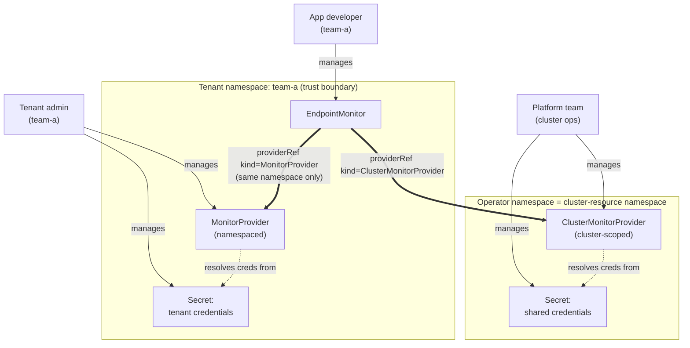
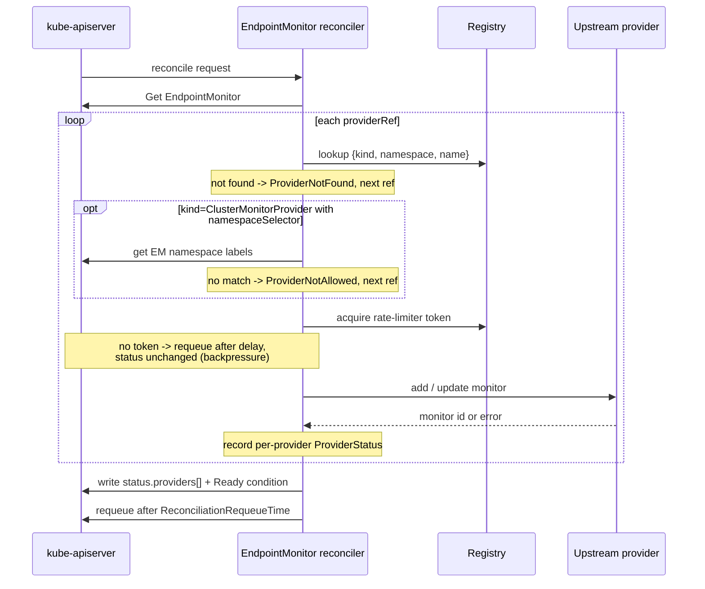
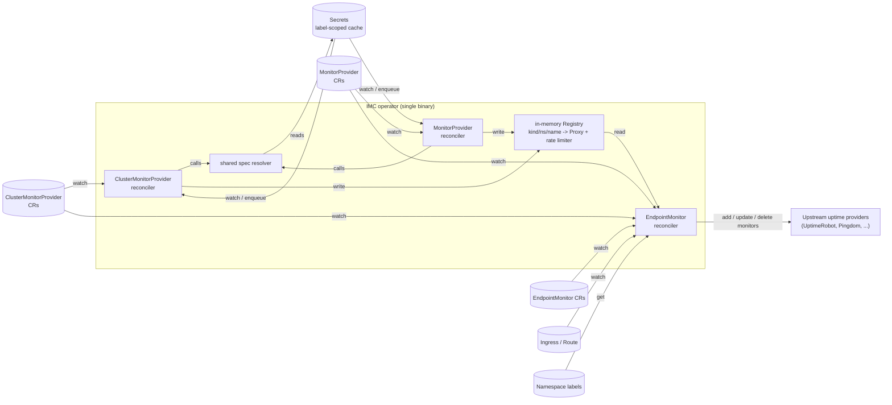

# IMC v3: Declarative Provider Configuration — Design

> **Status:** Draft — pending review before implementation.
> **Audience:** IMC maintainers and contributors.
> **Scope:** Replaces the boot-time `imc-config` Secret with a declarative,
> multi-tenant, CRD-driven model.

## Table of contents

- [1. Problem](#1-problem)
- [2. Goals](#2-goals)
- [3. Non-Goals](#3-non-goals)
- [4. Design](#4-design)
  - [4.1 Two CRD kinds](#41-two-crd-kinds)
  - [4.2 Provider registry](#42-provider-registry)
  - [4.3 Updated EndpointMonitor](#43-updated-endpointmonitor)
  - [4.4 Resolved decisions](#44-resolved-decisions)
  - [4.5 Tenancy model](#45-tenancy-model)
  - [4.6 RBAC and trust boundaries](#46-rbac-and-trust-boundaries)
  - [4.7 Reconciliation flow](#47-reconciliation-flow)
  - [4.8 Failure semantics](#48-failure-semantics)
- [5. CRD shapes](#5-crd-shapes)
  - [5.1 ClusterMonitorProvider (cluster-scoped)](#51-clustermonitorprovider-cluster-scoped)
  - [5.2 MonitorProvider (namespaced)](#52-monitorprovider-namespaced)
  - [5.3 Updated EndpointMonitor](#53-updated-endpointmonitor)
- [6. Internal architecture](#6-internal-architecture)
  - [6.1 Replaced/removed components](#61-replacedremoved-components)
  - [6.2 Unchanged components](#62-unchanged-components)
  - [6.3 Shared spec via Go embedding](#63-shared-spec-via-go-embedding)
- [7. Migration (v2 → v3)](#7-migration-v2--v3)
- [8. Open concerns to revisit during implementation](#8-open-concerns-to-revisit-during-implementation)
- [9. Out of scope (deferrable to later minor versions)](#9-out-of-scope-deferrable-to-later-minor-versions)

## 1. Problem

Today, IngressMonitorController loads provider credentials and global behavior from a single Secret (`imc-config`) at startup. This couples three concerns that should be independent:

1. **Operator lifecycle** (managed by Stakater / cluster ops) — when IMC runs.
2. **Provider configuration** (managed by users) — which uptime checkers are wired up, with what credentials.
3. **Monitor definitions** (managed by app teams) — what endpoints get monitored.

Consequences of the current design:
- IMC **cannot start** without a config Secret. `SetupMonitorServicesForProviders` panics on an empty providers list.
- Adding, removing, or rotating a provider requires editing a Secret and **restarting the operator**.
- Provider config is **opaque to Kubernetes** — no status, no validation, no events. Failures surface only in operator logs.
- Only **one instance per provider type** is possible (the type is also the discriminator key).
- The split between "operator concern" and "user concern" is muddled.
- **Multi-tenancy is unsupported.** A single cluster-wide config Secret cannot represent per-tenant credentials or per-tenant provider accounts. Stakater's clusters are multi-tenant by design, so this is a first-class gap.

## 2. Goals

- Operator runs healthy with **zero provider configuration**.
- Users add, change, and remove providers via standard `kubectl apply` of CRs.
- Credentials live in Secrets, not in CRs.
- Multiple instances of the same provider type are supported (e.g. `uptimerobot-prod` and `uptimerobot-staging`).
- Per-provider status visible via `kubectl get ...`.
- **Multi-tenant clusters are a first-class use case.** Tenants can own their own providers and credentials end-to-end without cross-tenant data exposure.
- Stakater's operator lifecycle, the platform team's shared providers, and the tenant team's local providers are all **independently managed**.

## 3. Non-Goals

- Backward compatibility with the `imc-config` Secret. **Clean cut to v3.0.0.**
- API-level credential validation. The provider reconcilers resolve Secret references and trust them; credential validity surfaces only when the first EndpointMonitor reconciles.
- Webhook-based admission validation. CEL on the CRD plus reconciler-time checks are sufficient; webhooks can come later if needed.
- Cross-tenant provider sharing through namespaced CRDs. Sharing happens via `ClusterMonitorProvider` only; namespaced `MonitorProvider`s are strictly tenant-local.

## 4. Design

### 4.1 Two CRD kinds

The design mirrors cert-manager (`Issuer` / `ClusterIssuer`) and external-secrets (`SecretStore` / `ClusterSecretStore`). Two CRDs share an identical spec but differ in scope:

- **`ClusterMonitorProvider`** (cluster-scoped) — shared providers managed by the platform team. Credentials live in the cluster-resource namespace. Referenceable from any namespace by default, optionally restricted to specific namespaces via `spec.namespaceSelector` (see 4.5).
- **`MonitorProvider`** (namespaced) — tenant-owned providers. Credentials live in the same namespace as the CR. Can only be referenced by `EndpointMonitor`s in the *same* namespace.

Both kinds share a common spec core (`MonitorProviderCommonSpec`); each kind adds a small number of kind-specific fields (see 6.3). The provider config surface, validation, and behavior knobs are identical across kinds.

### 4.2 Provider registry

An in-memory, in-process, thread-safe map from a composite key to a constructed `MonitorServiceProxy`. The key is `kind/namespace/name`:

- `ClusterMonitorProvider//uptimerobot-shared`
- `MonitorProvider/team-a/uptimerobot-prod`

Two **separate reconcilers** (one per kind) populate the registry; the `EndpointMonitor` reconciler reads from it. Two reconcilers rather than one shared reconciler because:

- Each kind has its own RBAC scope and watch semantics.
- Per-kind status conditions and finalizer logic are cleaner when not fanned out from one shared loop.
- Code reuse comes from sharing the *spec resolution* helper, not from sharing the controller loop.

### 4.3 Updated `EndpointMonitor`

- New required field `spec.providerRefs []ProviderReference` (min items: 1, **max items: 10**).
- Each `ProviderReference` has a **required** `kind` field (no default) and a `name`. `kind` enum: `ClusterMonitorProvider` | `MonitorProvider`. Forcing `kind` explicitly removes ambiguity around tenant boundaries.
- `ProviderReference` schema is `{Kind, Name}` only — **no `Namespace` field**. There is no way to spell a cross-namespace reference; the tenancy boundary is enforced structurally by the registry lookup (see 4.7).
- New optional field `spec.deletionPolicy` (`Retain` | `Delete`) that overrides the provider-level `enableMonitorDeletion`.
- Old field `spec.providers string` (comma-separated type list) is **removed**.
- Status now reports per-provider outcome in `status.providers[]` and an overall `Ready` condition.
- A single `EndpointMonitor` may mix references: e.g. one `ClusterMonitorProvider` plus one local `MonitorProvider`. Mixed `providerRefs` is supported by design.

### 4.4 Resolved decisions

| Question | Decision |
|---|---|
| Scope of provider CRs | Both: `ClusterMonitorProvider` (cluster) + `MonitorProvider` (namespaced) |
| Backward compatibility with `imc-config` | None — clean cut, v3.0.0 |
| Default provider when none specified | Not allowed; `providerRefs` is required |
| EndpointMonitor → providers cardinality | Multi-provider via list of refs |
| `kind` field on `ProviderReference` | **Required** — no default, force the choice |
| Mixed-kind `providerRefs` | Allowed |
| Where `enableMonitorDeletion` lives | Provider default, EndpointMonitor `deletionPolicy` overrides |
| ClusterMonitorProvider credential namespace | Operator namespace by default; overridable via `--cluster-resource-namespace` CLI flag (cert-manager pattern) |
| MonitorProvider credential namespace | Same namespace as the MonitorProvider CR |
| Cross-namespace `MonitorProvider` references | **Forbidden.** EndpointMonitor may only reference MonitorProviders in its own namespace. |
| Credential verification at reconcile time | Resolve-only; trust the Secret |
| Reconciler architecture | Two reconcilers (one per kind), shared spec-resolution helper |
| Operator RBAC for Secrets | Cluster-wide `secrets:get` on the operator's ClusterRole (cert-manager pattern) |
| Secret cache scope | Label-selected: `endpointmonitor.stakater.com/managed=true` (memory/perf optimization, not a security boundary) |
| `monitorNameTemplate` on `ClusterMonitorProvider` | **Not exposed.** Hardcoded to `{{.Namespace}}-{{.Name}}` to prevent cross-tenant collisions on shared providers. Field remains on `MonitorProvider` where the tenant owns the namespace. |
| `providerRefs` cardinality | Max 10 per `EndpointMonitor` (CRD `MaxItems`). EM-per-provider cardinality unbounded (see section 8). |
| EM finalizer when registry entry is missing | Skip upstream cleanup, emit `OrphanedMonitor` event with provider kind+name, allow EM deletion to complete. |
| `ClusterMonitorProvider` namespace scoping | Optional `spec.namespaceSelector` (label selector). Empty/absent = referenceable from all namespaces (default). Mirrors external-secrets `ClusterSecretStore.spec.conditions`. |
| Per-provider rate limiting | Static token bucket per provider. Optional `spec.rateLimit` (requests/minute) on the common spec; sane hardcoded default if unset. Adaptive 429-based backoff deferred to v3.1. |
| Status conditions | Standard `metav1.Condition` type (enables `kubectl wait --for=condition=Ready`), with per-condition `observedGeneration`. |
| `kubectl get` output | `additionalPrinterColumns` on all three CRDs (Type / Ready / Age). |

### 4.5 Tenancy model

This section is the load-bearing one for Stakater's use case. Spelling it out explicitly.



**A tenant is a namespace (or set of namespaces) under a single owner.** IMC inherits whatever namespace-based tenancy model the cluster already uses. IMC does not introduce its own tenant abstraction.

**Two usage patterns are supported and intended to coexist in one cluster:**

*Pattern 1 — Shared provider (platform-managed).* The platform team operates one upstream account (e.g. one UptimeRobot account for the whole org). They create a `ClusterMonitorProvider` and the corresponding Secret in the operator namespace. Any tenant can reference it from their `EndpointMonitor`s. Monitors from all tenants appear in the shared upstream dashboard — name collisions are prevented by `monitorNameTemplate` (default `{{.Namespace}}-{{.Name}}`).

*Pattern 2 — Tenant-owned provider (tenant-managed).* A tenant has their own upstream account (e.g. their own UptimeRobot account, billed separately, isolated dashboard). They create a `MonitorProvider` and the credential Secret in their own namespace. Only `EndpointMonitor`s in that same namespace can reference it. The platform team has no operational role beyond running the operator.

**Mixing is fine.** A tenant can use the shared `ClusterMonitorProvider` for some monitors and their own `MonitorProvider` for others, in the same or different `EndpointMonitor` resources.

**What tenancy IMC does *not* guarantee:**
- By default IMC does not prevent two tenants from referencing the same `ClusterMonitorProvider` — that's the shared pattern. A platform team that wants to restrict which tenants may use a shared provider sets `spec.namespaceSelector` on the `ClusterMonitorProvider`: only `EndpointMonitor`s in namespaces whose labels match the selector may reference it. An empty/absent selector preserves the open default. This mirrors external-secrets' `ClusterSecretStore.spec.conditions`.
- Cross-tenant monitor name collisions are prevented **structurally** on shared providers: `ClusterMonitorProvider` does not expose `monitorNameTemplate` — the template is hardcoded to `{{.Namespace}}-{{.Name}}`. Tenants using `MonitorProvider` own their own namespace, so the template knob there is theirs to misconfigure within their own scope.
- IMC does not enforce that a tenant's `MonitorProvider` references credentials only from their own namespace's Secrets. By construction — the credential `secretKeyRef` is namespace-local for `MonitorProvider`, so there's no cross-namespace credential leak possible.

### 4.6 RBAC and trust boundaries

| Concern | Owner | Mechanism |
|---|---|---|
| Operator deployment, image version, ClusterRole | Stakater / cluster ops | Helm chart |
| Shared provider definition | Platform team | `ClusterMonitorProvider` CR |
| Shared provider credentials | Platform team | Secret in operator namespace |
| Tenant provider definition | Tenant admin | `MonitorProvider` CR in tenant namespace |
| Tenant provider credentials | Tenant admin | Secret in tenant namespace |
| Endpoint monitoring | App developer in tenant namespace | `EndpointMonitor` CR |
| Deletion policy override | App developer | `EndpointMonitor.spec.deletionPolicy` |

**Operator permissions in v3:**
- `endpointmonitor.stakater.com/{endpointmonitors,monitorproviders,clustermonitorproviders}`: full CRUD + status.
- `core/secrets`: **cluster-wide get/list/watch.** Necessary so the operator can read credential Secrets from any tenant namespace. This matches cert-manager and external-secrets; the alternative (per-namespace RoleBindings at tenant onboarding) creates operational friction without meaningfully improving security since the operator already has cluster-wide access to many resources.
- `networking.k8s.io/ingresses`, `route.openshift.io/routes`: as today.

**Secret cache scope (perf, not security):**
The controller-runtime cache is configured to only hold Secrets carrying the label `endpointmonitor.stakater.com/managed=true`. This keeps memory bounded on clusters with thousands of unrelated Secrets. It is **not** a security boundary — the operator's RBAC still permits `get` on any Secret via `apiReader`. Users are expected to label every Secret referenced by a `*MonitorProvider`; an unlabeled Secret will surface as `CredentialsResolved=False` on the referencing CR.

**Threat-model implications:**
- A compromised tenant cannot read another tenant's credentials directly; Secrets are namespace-isolated.
- A compromised tenant cannot reference another tenant's `MonitorProvider`; the same-namespace constraint is enforced at reconcile time.
- A compromised operator can read all Secrets cluster-wide. The blast radius of the operator is therefore "all IMC-managed providers' credentials," which is unavoidable given the operator's job.

### 4.7 Reconciliation flow

**`ClusterMonitorProvider` reconciler:**
1. Resolve `SecretKeyRef`s from the **cluster-resource namespace** — the operator namespace by default, overridable via the `--cluster-resource-namespace` CLI flag.
2. Build `monitors.ProviderConfig`.
3. Call `monitors.CreateMonitorService(pc)`; store proxy in registry under key `ClusterMonitorProvider//<name>`.
4. Set `status.conditions[Ready]=True`.

**`MonitorProvider` reconciler:**
1. Resolve `SecretKeyRef`s from the **same namespace as the CR**.
2. Build `monitors.ProviderConfig`.
3. Call `monitors.CreateMonitorService(pc)`; store proxy in registry under key `MonitorProvider/<ns>/<name>`.
4. Set `status.conditions[Ready]=True`.

**Either reconciler on delete:** finalizer removes the registry entry. `EndpointMonitor`s that referenced it fail closed on next reconcile.

**`EndpointMonitor` reconciler:**
1. For each `providerRef`:
   - If `kind: ClusterMonitorProvider`, look up `ClusterMonitorProvider//<name>` in registry.
   - If `kind: MonitorProvider`, look up `MonitorProvider/<endpointmonitor's namespace>/<name>` in registry. **Same-namespace constraint enforced here**: there is no path to look up a MonitorProvider in a different namespace.
2. If not found: record `ProviderStatus{Ready: false, Reason: ProviderNotFound}` and continue.
3. If found and `kind: ClusterMonitorProvider` with a non-empty `namespaceSelector`: match the `EndpointMonitor`'s namespace labels against the selector. No match → record `ProviderStatus{Ready: false, Reason: ProviderNotAllowed}` and continue.
4. Acquire a token from the provider's rate limiter. If none is available, requeue the `EndpointMonitor` after the limiter's reported delay **without mutating status** — this is backpressure, not a failure.
5. Otherwise: call the proxy to add/update the upstream check. Record per-provider status.
6. Set top-level `Ready=False` with `Reason=PartialFailure` if any provider failed; otherwise `Ready=True`.

The `EndpointMonitor` reconcile sequence, including the ordering of the namespace-selector check and the rate limiter:



**Secret change in operator namespace:** enqueue every `ClusterMonitorProvider` referencing that Secret.

**Secret change in a tenant namespace:** enqueue every `MonitorProvider` in that namespace referencing that Secret.

**Namespace deletion (tenant namespace deleted while monitors exist):**
- The namespace's `MonitorProvider`s and `EndpointMonitor`s are deleted by Kubernetes garbage collection.
- For each `EndpointMonitor` being deleted, the **EndpointMonitor's own `deletionPolicy`** (or the provider's `enableMonitorDeletion` default) determines whether the upstream monitor is removed.
- Finalizer on `EndpointMonitor` performs the upstream cleanup before the resource is removed.
- **If the provider's registry entry is missing** (e.g. the `MonitorProvider` finalizer ran first during a namespace delete, or the provider CR was deleted independently), the EM finalizer **skips upstream cleanup**, emits an `OrphanedMonitor` event recording the provider kind+name and the upstream monitor identifier (if known), and allows the EM to be deleted. No retry loop, no `Terminating` deadlock.
- **If the upstream provider is reachable but errors**, the finalizer retries with exponential backoff up to a bounded budget, then takes the same skip-and-emit path.
- In both cases the upstream monitor is **orphaned** in the provider's account. Recovery: manual cleanup in the provider's UI; the emitted events are the audit trail.

### 4.8 Failure semantics

| Failure | Behavior |
|---|---|
| Operator boots with no `*MonitorProvider`s | Runs healthy. Logs "no providers configured." |
| Provider CR references a missing Secret | `Ready=False`, `CredentialsResolved=False`. Requeue with backoff. Registry entry cleared if previously present (fail closed). |
| `EndpointMonitor` references a missing provider | Per-provider status: `ProviderNotFound`. Other providers continue. Top-level `Ready=False`. Requeue. |
| `EndpointMonitor` references a `ClusterMonitorProvider` it is not allowed to use | Per-provider status: `ProviderNotAllowed` (namespace labels don't match the provider's `namespaceSelector`). Other providers continue. Top-level `Ready=False`. |
| Provider rate limit reached during reconcile | `EndpointMonitor` requeued after the limiter's delay. No status change, not counted as a failure — pure backpressure. |
| One of several providers fails at reconcile | Degraded, not failed. Other providers continue. Top-level `Ready=False`, `Reason=PartialFailure`. Per-provider status pinpoints the failure. |
| Provider CR deleted while EndpointMonitors reference it | Registry entry removed. EndpointMonitors fail closed on next reconcile (`ProviderNotFound`). |
| Tenant namespace deleted | EM and `MonitorProvider` both deleted by GC. EM finalizer attempts upstream cleanup; if the MP finalizer already removed the registry entry, EM skips cleanup, emits `OrphanedMonitor` event, completes deletion. Same fallback if the upstream is unreachable after retry budget. |
| Cross-kind name collision (`ClusterMonitorProvider/foo` and `MonitorProvider/team-a/foo`) | **Intentional and supported.** The required `kind` field on `ProviderReference` disambiguates. Registry composite keys handle storage. No warning, no special behavior — this is a normal case. |

## 5. CRD shapes

### 5.1 `ClusterMonitorProvider` (cluster-scoped)

```yaml
apiVersion: endpointmonitor.stakater.com/v1alpha1
kind: ClusterMonitorProvider
metadata:
  name: uptimerobot-shared
spec:
  type: UptimeRobot
  uptimeRobot:
    apiKeySecretRef:
      name: uptimerobot-creds
      key: apiKey            # Secret lives in operator namespace
    alertContacts: "1234_0_0"
  enableMonitorDeletion: false
  creationDelay: "30s"
  rateLimit: 60              # max upstream requests/minute (optional; default applies if unset)
  namespaceSelector:         # optional; absent = referenceable from all namespaces
    matchLabels:
      imc.stakater.com/tier: production
  # monitorNameTemplate is NOT exposed on ClusterMonitorProvider.
  # Hardcoded to "{{.Namespace}}-{{.Name}}" to prevent cross-tenant collisions.
status:
  observedGeneration: 1
  conditions:
    - type: Ready
      status: "True"
      reason: ProviderConstructed
    - type: CredentialsResolved
      status: "True"
      reason: Ready
```

### 5.2 `MonitorProvider` (namespaced)

Identical spec, different scope, credentials read from the CR's namespace:

```yaml
apiVersion: endpointmonitor.stakater.com/v1alpha1
kind: MonitorProvider
metadata:
  name: uptimerobot-prod
  namespace: team-a
spec:
  type: UptimeRobot
  uptimeRobot:
    apiKeySecretRef:
      name: uptimerobot-creds
      key: apiKey            # Secret lives in team-a namespace
    alertContacts: "9876_0_0"
  enableMonitorDeletion: true
  rateLimit: 60                     # common-spec field; present on both kinds
  monitorNameTemplate: "{{.Name}}"  # tenant owns the namespace; no namespace prefix needed
```

Supported types for both kinds: `UptimeRobot`, `Pingdom`, `PingdomTransaction`, `StatusCake`, `Uptime`, `Updown`, `AppInsights`, `GCloud`, `Grafana`.

CEL validation enforces that the config block matches `spec.type`.

### 5.3 Updated `EndpointMonitor`

```yaml
apiVersion: endpointmonitor.stakater.com/v1alpha1
kind: EndpointMonitor
metadata:
  name: frontend
  namespace: team-a
spec:
  providerRefs:
    - kind: MonitorProvider             # tenant-owned, must be in team-a
      name: uptimerobot-prod
    - kind: ClusterMonitorProvider      # shared platform-managed
      name: pingdom-shared
  deletionPolicy: Retain                # overrides each provider's default
  forceHttps: true
  urlFrom:
    ingressRef:
      name: frontend
status:
  providers:
    - kind: MonitorProvider
      name: uptimerobot-prod
      ready: true
      monitorID: "798123"
    - kind: ClusterMonitorProvider
      name: pingdom-shared
      ready: false
      reason: AuthFailed
      message: "401 from Pingdom API"
  conditions:
    - type: Ready
      status: "False"
      reason: PartialFailure
```

## 6. Internal architecture



Three reconcilers, one shared registry. Two of the reconcilers (ClusterMonitorProvider, MonitorProvider) write to the registry; the third (EndpointMonitor) reads from it.

### 6.1 Replaced/removed components

- `pkg/config/config.go` — deleted. Replaced by `pkg/monitors/provider-config.go` (resolved runtime config) and the provider reconcilers (config source).
- `monitors.SetupMonitorServicesForProviders` — deleted. Replaced by per-CR construction in the new reconcilers.
- `config.Provider` — deleted. Replaced by `monitors.ProviderConfig`.
- Env vars `CONFIG_SECRET_NAME`, references to `imc-config` — deleted.

### 6.2 Unchanged components

- The `MonitorService` interface and the per-provider packages under `pkg/monitors/*`. Their `Setup` signature changes type but not behavior. **Provider implementations are tenancy-unaware** — they receive a `ProviderConfig` regardless of whether the source CRD was cluster-scoped or namespaced. The reconcilers handle the namespace dimension; the provider code does not.
- `EndpointMonitor` URL/ingress/route resolution logic.
- Provider-specific spec blocks on `EndpointMonitor` (e.g. `uptimeRobotConfig`).

### 6.3 Shared spec via Go embedding

The two kinds share a common spec struct but are **not identical** — `ClusterMonitorProvider` deliberately omits `monitorNameTemplate` (see 4.5). The chosen structure:

- `MonitorProviderCommonSpec` — provider `type`, all provider config blocks, `enableMonitorDeletion`, `creationDelay`, `rateLimit`. This is the shared core.
- `ClusterMonitorProvider.spec` embeds `MonitorProviderCommonSpec` and adds `NamespaceSelector *metav1.LabelSelector`. It does **not** have a `monitorNameTemplate` field — it does not exist, so it cannot be set; the template is hardcoded to `{{.Namespace}}-{{.Name}}` in the reconciler.
- `MonitorProvider.spec` embeds `MonitorProviderCommonSpec` and adds `MonitorNameTemplate string`.

This guarantees:
- Identical YAML field names for every shared field across kinds.
- One place to add a new provider type (e.g. a future `Datadog` block) — both kinds get it for free.
- One set of validation rules for the shared core.
- Compile-time exclusion of `monitorNameTemplate` from the cluster kind — no CEL rule needed, no way to set the field.

Status types are likewise shared: both kinds use a common `MonitorProviderStatus` shape.

## 7. Migration (v2 → v3)

This is a **breaking** change. Documented migration steps for users:

1. Upgrade CRDs (`ClusterMonitorProvider` and `MonitorProvider` are new; `EndpointMonitor` schema changed).
2. **Decide tenancy fit for each provider in your old `imc-config`:**
   - Is the provider shared org-wide? Create a `ClusterMonitorProvider`. Move credentials to a Secret in the operator namespace.
   - Is the provider tenant-specific? Create a `MonitorProvider` in the tenant's namespace, with credentials in the same namespace.
3. For each `EndpointMonitor`, replace `spec.providers: "UptimeRobot,Pingdom"` with `spec.providerRefs: [{kind: ..., name: ...}, ...]`. **The `kind` field is required**, so users must consciously pick.
4. Upgrade the operator. The old `imc-config` Secret is no longer read and can be deleted.

Provide a `docs/migration-v2-to-v3.md` with concrete before/after examples for both the single-tenant case (everything becomes `ClusterMonitorProvider`) and the multi-tenant case (some shared, some local).

## 8. Open concerns to revisit during implementation

These are flagged but not blocking the design:

1. **Status visibility for tenants referencing ClusterMonitorProvider.** A tenant whose RBAC does not grant `get clustermonitorproviders` cannot directly inspect the provider they're referencing. The `EndpointMonitor`'s own status (which they *can* read) reports per-provider readiness, so they're not blind, but they cannot see *why* the upstream provider is unhealthy without platform-team involvement. Acceptable trade-off; document it.

2. **Operational discovery of orphaned monitors.** The finalizer skip-and-emit path (section 4.7) guarantees the cluster doesn't deadlock on namespace deletion, but operators still have to find orphans in the upstream provider's UI. Possible follow-up: a small `imc orphans` admin command that diffs registry state vs. upstream. Out of scope for v3.0; tracked for v3.1.

3. **EM-per-provider cardinality.** `providerRefs` is now capped at 10 per EM (resolved). The reverse direction — how many `EndpointMonitor`s can reference one provider — remains unbounded. Likely fine, but worth load-testing during Phase 5.

## 9. Out of scope (deferrable to later minor versions)

- API-level credential probing (`spec.verifyCredentials: true`).
- Adaptive rate limiting — dynamically backing off based on observed HTTP 429s from the provider. v3.0 ships only the static token bucket (`spec.rateLimit`); adaptive backoff is deferred to v3.1.
- Per-namespace RBAC scoping for Secret reads (alternative to cluster-wide). Could be a Helm option later if a customer demands it.
- Webhook-based validation beyond CEL.
- Metrics emitted from the registry (provider count, last-resolve time, per-kind breakdown).
- Tenant-facing read-through view of `ClusterMonitorProvider` status (some kind of projected status field on EndpointMonitor).
