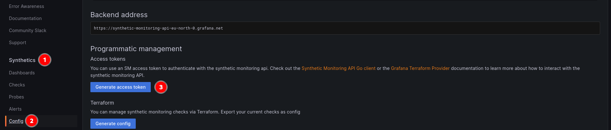

# Grafana Configuration

You can configure Grafana Synthetic Monitoring as an Ingress Monitor by using the configuration below:

| Key           | Description                                                                          |
| ------------- | ------------------------------------------------------------------------------------ |
| name          | Name of the provider (e.g., Grafana)                                                 |
| apiKey        | Synthetic monitoring access token                                                    |
| grafanaConfig | `grafanaConfig` is the configuration specific to Grafana instance as mentioned below:|

## Synthectic Monitoring Access Token
To obtain an access token for synthetic monitoring, first enable synthetic monitoring in your Grafana Cloud account. Then, navigate to the Configuration tab and generate a new token there.


## gcloud Configuration:

| Key       | Description                                                      |
| --------- | ---------------------------------------------------------------- |
| frequency | How frequently the check should run (in milliseconds).           |


**Example Configuration:**

```yaml
providers: 
  - name: Grafana
    apiKey: <ACCESS TOKEN>
    apiURL: https://synthetic-monitoring-api-eu-north-0.grafana.net
    grafanaConfig:
      frequency: 5000
enableMonitorDeletion: true
```

## Example Kubernetes Manifest: 

```yaml
apiVersion: endpointmonitor.stakater.com/v1alpha1
kind: EndpointMonitor
metadata:
  name: stakater
spec:
  forceHttps: true
  url: https://stakater.com/
  grafanaConfig:
    frequency: 10000
    probes:
      - Amsterdam
      - Singapore
```
